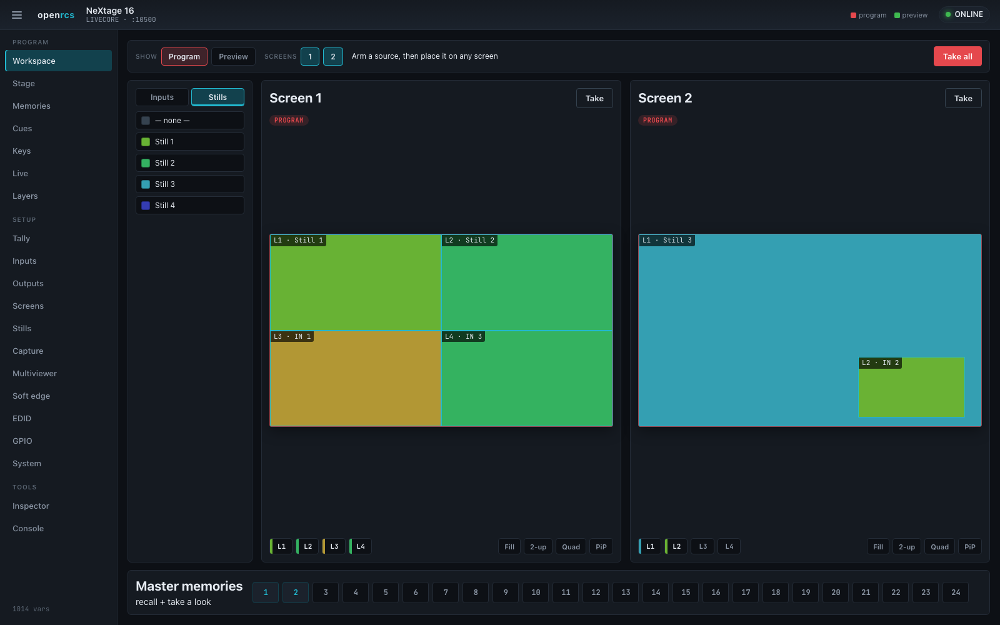

# openrcs

> **AI-assisted project.** This codebase was created with [Claude](https://claude.com/claude-code)
> (Anthropic), directed and reviewed by a human author. The protocol was
> reverse-engineered rather than taken from a published specification. Both the
> LiveCore and Midra sides have since been validated against real hardware, but
> device behaviour varies with model, firmware and signal state — check against
> your own processor before a show. See [Status](#status).

A Rust library for controlling **Analog Way Midra and LiveCore series** video
processors over their native TCP control protocol.

It targets the Midra family (Pulse2, Eikos2, Saphyr, SmartMatriX2, QuickMatriX,
QuickVu) and the LiveCore family (Ascender 16/32/48, NeXtage 8/16, SmartMatriX
Ultra) — a modern, dependency-light control surface for hardware whose original
software is long out of date.



**[Try the control surface in your browser →](https://openrcs-demo.stoatworks-labs.com)**
— the real UI, unmodified, running against a simulated device. No processor is
involved and nothing can reach hardware: a browser has no raw TCP socket, so the
demo replaces the transport and keeps the app. See [demo/](demo/) for how it
works and what it can't show.

Not affiliated with or endorsed by Analog Way. Product names are used only to
describe compatibility.

<!-- downloads:start -->

## Download

**[v0.3.0](https://github.com/stoatworks-labs/openrcs/releases/tag/v0.3.0)** — prebuilt for macOS, Windows and Linux. Pick your platform:

<details>
<summary><b>macOS</b> — Apple Silicon, Intel</summary>

| Build | Download | Size |
| --- | --- | --- |
| Apple Silicon · .dmg disk image (CLI) | [`openrcs-server-0.3.0-macos-aarch64-cli.dmg`](https://github.com/stoatworks-labs/openrcs/releases/download/v0.3.0/openrcs-server-0.3.0-macos-aarch64-cli.dmg) | 1.5 MB |
| Intel · .dmg disk image (CLI) | [`openrcs-server-0.3.0-macos-x86_64-cli.dmg`](https://github.com/stoatworks-labs/openrcs/releases/download/v0.3.0/openrcs-server-0.3.0-macos-x86_64-cli.dmg) | 1.5 MB |
| Apple Silicon · .pkg installer (CLI) | [`openrcs-server-0.3.0-macos-aarch64-cli.pkg`](https://github.com/stoatworks-labs/openrcs/releases/download/v0.3.0/openrcs-server-0.3.0-macos-aarch64-cli.pkg) | 1.0 MB |
| Intel · .pkg installer (CLI) | [`openrcs-server-0.3.0-macos-x86_64-cli.pkg`](https://github.com/stoatworks-labs/openrcs/releases/download/v0.3.0/openrcs-server-0.3.0-macos-x86_64-cli.pkg) | 1.0 MB |
| Apple Silicon · .tar.gz archive | [`openrcs-server-0.3.0-macos-aarch64.tar.gz`](https://github.com/stoatworks-labs/openrcs/releases/download/v0.3.0/openrcs-server-0.3.0-macos-aarch64.tar.gz) | 991 KB |
| Intel · .tar.gz archive | [`openrcs-server-0.3.0-macos-x86_64.tar.gz`](https://github.com/stoatworks-labs/openrcs/releases/download/v0.3.0/openrcs-server-0.3.0-macos-x86_64.tar.gz) | 1.0 MB |

</details>

<details>
<summary><b>Windows</b> — x64, ARM64</summary>

| Build | Download | Size |
| --- | --- | --- |
| x64 · .exe installer | [`openrcs-server-0.3.0-windows-x86_64-setup.exe`](https://github.com/stoatworks-labs/openrcs/releases/download/v0.3.0/openrcs-server-0.3.0-windows-x86_64-setup.exe) | 698 KB |
| ARM64 · .exe installer | [`openrcs-server-0.3.0-windows-aarch64-setup.exe`](https://github.com/stoatworks-labs/openrcs/releases/download/v0.3.0/openrcs-server-0.3.0-windows-aarch64-setup.exe) | 640 KB |
| x64 · .zip archive | [`openrcs-server-0.3.0-windows-x86_64.zip`](https://github.com/stoatworks-labs/openrcs/releases/download/v0.3.0/openrcs-server-0.3.0-windows-x86_64.zip) | 840 KB |
| ARM64 · .zip archive | [`openrcs-server-0.3.0-windows-aarch64.zip`](https://github.com/stoatworks-labs/openrcs/releases/download/v0.3.0/openrcs-server-0.3.0-windows-aarch64.zip) | 808 KB |

</details>

<details>
<summary><b>Linux</b> — x64, ARM64</summary>

| Build | Download | Size |
| --- | --- | --- |
| x64 · .tar.gz archive | [`openrcs-server-0.3.0-linux-x86_64.tar.gz`](https://github.com/stoatworks-labs/openrcs/releases/download/v0.3.0/openrcs-server-0.3.0-linux-x86_64.tar.gz) | 959 KB |
| ARM64 · .tar.gz archive | [`openrcs-server-0.3.0-linux-aarch64.tar.gz`](https://github.com/stoatworks-labs/openrcs/releases/download/v0.3.0/openrcs-server-0.3.0-linux-aarch64.tar.gz) | 927 KB |

</details>

All builds, checksums and release notes: [github.com/stoatworks-labs/openrcs/releases](https://github.com/stoatworks-labs/openrcs/releases).

The Windows builds are unsigned, so SmartScreen warns once.

<!-- downloads:end -->

## Status

`openrcs-proto`, the protocol engine, is implemented and tested. The LiveCore
command table (1014 variables) and the Midra table (562) are complete with
per-variable dimensions, ranges, and read-only flags. Both have been validated
against real hardware — a **NeXtage 16** (LiveCore) and a **Pulse2** (Midra):
device identity, framing, live layer control and takes, memories, EDID and the
per-platform quirks are all confirmed on the wire. Per-variable ranges are still
strong guidance rather than a guarantee, and a few behaviours depend on model,
firmware or a live input signal.

`openrcs-server` adds a browser control surface over that engine (see below).
Roadmap: package it as a system-tray app, then a standalone gateway (Pi or
ESP32) between the processor and its clients. The protocol engine is
`no_std`-friendly so the same code backs all of them.

## Web control surface

`openrcs-server` bridges a browser control panel to a processor: it holds one
TCP connection to the device, caches state, and relays a small JSON protocol
over a websocket to any number of browsers.

**Prefer not to touch the command line?** Grab the
**[tray launcher](https://github.com/stoatworks-labs/openrcs/releases/tag/launcher-v0.1.0)**
(macOS, Windows, Linux) — a menu-bar app that bundles the server: enter the
switcher's IP, pick the model, click **Start**, then **Open**. The macOS builds
are signed and notarized.

Otherwise grab a prebuilt `openrcs-server` binary from the
[latest release](https://github.com/stoatworks-labs/openrcs/releases/latest)
(macOS, Linux and Windows; the UI is embedded, so it's a single self-contained
file), or run it from source:

```bash
cargo run -p openrcs-server -- --device <processor-ip>:10500 --platform livecore
# ...or --platform midra ; then open http://127.0.0.1:8730/
```

The UI is **platform-aware** — it reads the variable table the device advertises
and shows only the views that processor supports. It centres on a **Workspace**
working page — sources (inputs and stills), every screen editable side by side
in program, preview or both at once, one-click layout presets, and memories on a
single window-filling page — backed by a **Stage** overview, a graphical
**Layers** editor (drag/resize, source, opacity, border, crop, layer transitions,
built-in layouts), **Memories**, **Live** (take, master fade or freeze),
**Inputs**, **Outputs**, **Screens**, **Stills**, a live **Tally**,
**Multiviewer** and **Soft edge** designers, **EDID** management with a
custom-EDID writer, **GPIO**, **System**, an **Inspector** over every device
variable, and a raw-protocol **Console**. It's a dependency-free vanilla
ES-module app served by the server — no build step.

## Using the crate

```rust
use openrcs_proto::{encode_set_checked, Decoder, Frame, Platform};

// Drive screen 1's T-bar to 50% travel.
let cmd = encode_set_checked(Platform::Midra, "GCtba", &[1], 5000)?;
assert_eq!(cmd, "1,5000GCtba\r\n");

// Replies are the mirror image: mnemonic first, value last. The device also
// pushes unsolicited updates, so decode continuously.
let mut dec = Decoder::new();
for frame in dec.feed(b"GCtba1,5000\n") {
    match frame {
        Frame::Value(r) => println!("{} {:?} = {}", r.mnemonic, r.indices, r.value),
        Frame::Error(code) => eprintln!("device error {code}"),
    }
}
```

`encode_set_checked` validates index rank, index bounds, value range, and
read-only status against the variable table. `encode_set` skips the checks when
you want raw control.

```bash
cargo test                        # no hardware needed
cargo build --no-default-features # no_std

# Read-only probe against a device:
cargo run --example probe -- <device-ip>:10500 livecore
```

## The protocol in one paragraph

Both families speak a terse ASCII protocol over TCP 10500. Commands put the
5-character mnemonic last, replies put it first, and a reply's final
comma-separated field is the value. Midra terminates outbound commands with
CRLF, LiveCore with LF. The device pushes unsolicited updates and NAKs bad
commands with `E<code>`. A short summary is in [`docs/PROTOCOL.md`](docs/PROTOCOL.md).

The full protocol reference — framing, the variable model, and every variable
for both platforms — is a companion repository:
**[openrcs-protocol](https://github.com/stoatworks-labs/openrcs-protocol)**.

<!-- attributions:start -->
This project is built on other people's work — see [ATTRIBUTIONS.md](ATTRIBUTIONS.md).
<!-- attributions:end -->

## Licence

MIT.
