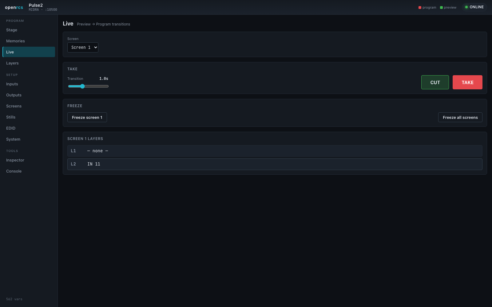
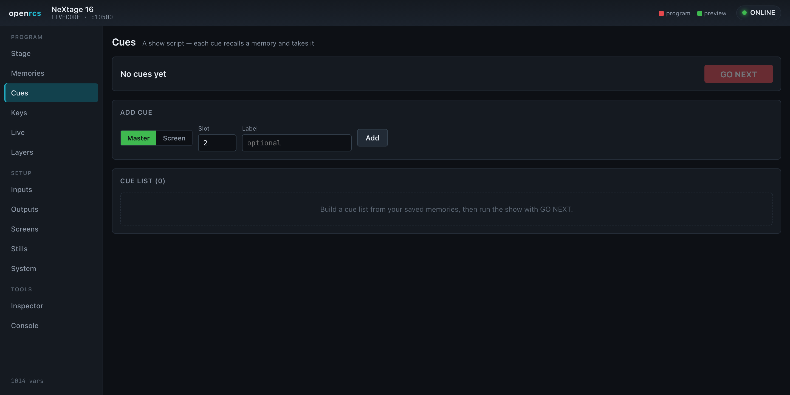
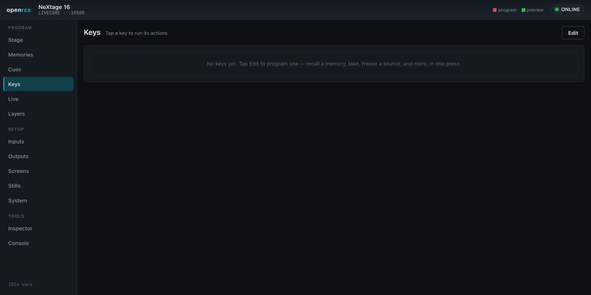
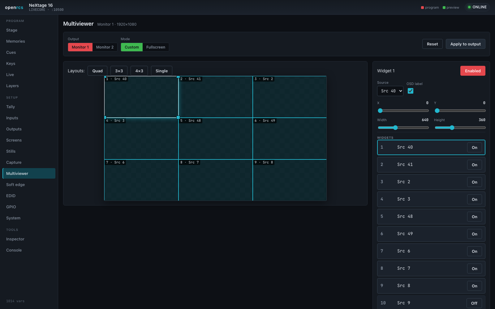
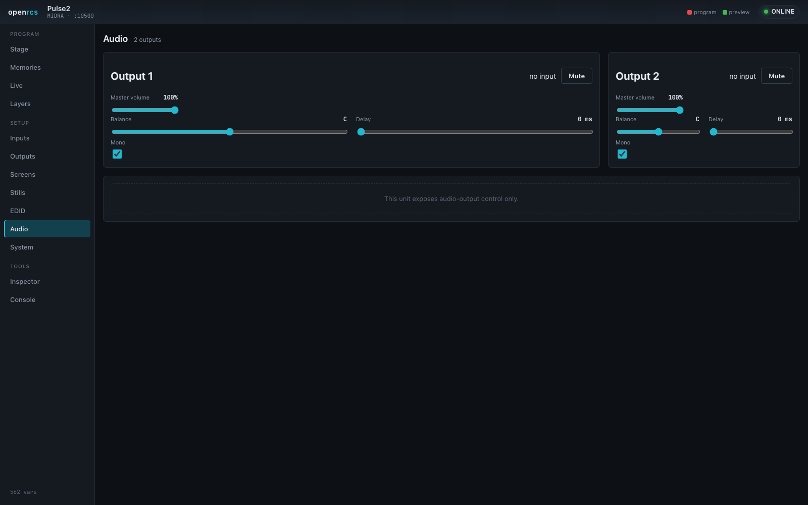
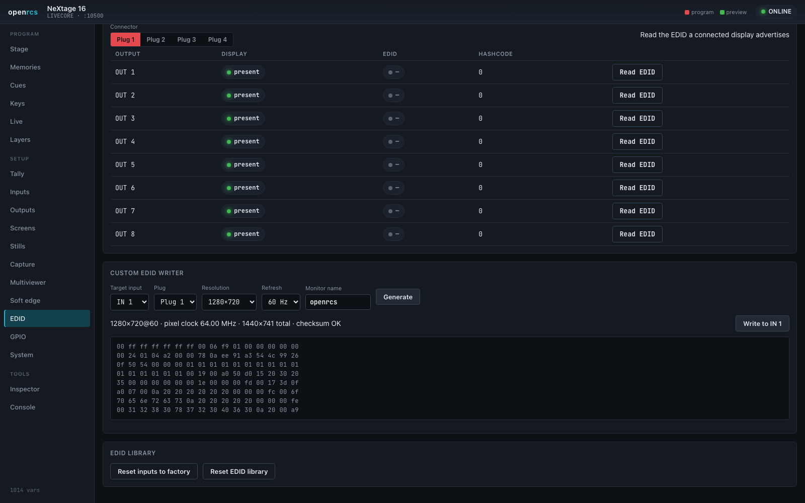

# openrcs — user guide

openrcs is a modern control surface for Analog Way **Midra** and **LiveCore**
series video processors. A small bridge server holds one connection to the
processor and serves a web UI to any number of browsers, so you can drive the
device from a laptop, a tablet, or a touch panel — no vendor runtime required.

## Running it

Start the bridge server, pointing it at the processor's control port (TCP
10500), and open the web UI:

```bash
cargo run -p openrcs-server -- --device <processor-ip>:10500 --platform livecore
# then open http://127.0.0.1:8730/
```

Use `--platform midra` for the Midra family. The header shows the device model,
platform and a connection indicator; every view updates live as the device — or
another operator — changes state.

`--device` is optional. Started without one, the server comes up unconfigured
and shows only the **Connection** view: enter the processor's address on the
on-screen keypad, or press **Scan** to look for processors on the network, pick
the platform and press **Connect**. The choice is written to a config file
(`~/.config/openrcs/config.json` by default, or `--config <file>`) and used on
the next start, so this only has to be done once. Connection also retargets a
running server — useful when one surface covers more than one processor.

The scan is read-only: it opens a connection, listens for the greeting each
platform sends unprompted, and never writes to anything it finds. A processor
that already has a control session open elsewhere may not answer it.

**No command line?** The [tray launcher](https://github.com/stoatworks-labs/openrcs/releases/tag/launcher-v0.1.0)
(macOS, Windows, Linux) bundles the server in a menu-bar app: enter the switcher's
IP, pick the model, click **Start**, then **Open**. Nothing else to install.

The interface is a single dark theme, chosen deliberately for the blacked-out
environments these processors live in. The left nav is grouped into **Program**
(the things you touch during a show), **Setup** (configuration), and **Tools**.

**It adapts to the device.** openrcs reads the variable table the processor
advertises and shows only the views that hardware actually supports — so a
LiveCore unit exposes the full set below, while a Midra unit shows the subset it
implements (and swaps in its own equivalents, e.g. a per-screen **Freeze** where
LiveCore offers a master fade). The two families model some things differently
— memories especially — and the UI follows each one's model rather than forcing a
single shape.



## New in this release

- **Show mode** — a stripped, big-target front-of-house surface: large CUT ALL /
  TAKE ALL, a TAKE tile per destination, and a grid of master-memory recall tiles.
  The one to drive a show from a touchscreen at front-of-house.
- **Wall** — where each screen sits in the output. Every screen is placed in the
  output-tile grid at its real position; drag to rearrange, then apply.
- **Destinations** — take, cut, T-bar and step-back whole **screen groups** as one
  destination, with a grouping editor and a TAKE ALL GROUPS.
- **Shows** — capture the device's writable state (the live look, the memory
  banks, input or output setup) to a portable JSON file and restore it. Restore
  re-reads the device first and writes only what differs. Also hosts
  **Confidence**, an instant cache-based undo that can auto-snapshot before every
  take.
- **Plan** — build a look with no device attached (reads preview your staged
  values), then push it to the processor on connect. Staged work persists across
  a reload; "Seed from look" starts from the current on-screen state.
- **Cues** now chain: mark a cue **autofollow** and it runs the next one after a
  per-cue wait, with a **HOLD** to pause and per-cue notes.

On LiveCore, a **take** now animates the T-bar directly rather than firing the
device's own take verbs — on real hardware those leave the group stuck
mid-transition, so openrcs sweeps the bar over the transition time instead.

## Workspace


One page that mirrors how you actually drive a show, with everything in reach:
the **source palette** down the left, **every active screen** in the middle with
its program above its preview, and the **layer properties** panel on the right.
The page fits the window — the previews grow to fill the space — and the memory
strip along the bottom folds away when you want more room. Collapse the main menu
with the button top-left (it stays collapsed) for more space still.

- **Drag a source onto a layer.** Drag from the palette onto a layer rectangle,
  onto a layer slot, or onto bare canvas — dropping on the canvas puts the source
  on the first free layer, where you let go. Clicking a source **arms** it instead,
  for touch panels: arm, then tap a layer. Arm **— none —** to clear a layer.
  The palette has **Inputs**, **Stills** and **Other** tabs on LiveCore.
- **Live thumbnails.** Where the device offers them (LiveCore inputs), the palette
  and the layers on the canvas show the actual picture on that input, refreshed a
  few times a minute. openrcs turns the device's snapshot system on for you.
- **Drag and resize** layers directly on each canvas, with every screen live at
  once, and use the **layout presets** — Fill, 2-up, 3-up, Quad, PiP, Stack — to
  arrange a screen's assigned sources into a common look in one click.
- **The layer properties panel** opens when you select a layer, and exposes
  everything the device holds for it: source and z-order, position and size (with
  keep-aspect, screen size, content size, a nine-point placement pad and aspect
  ratio presets), transparency and the master fader, cropping and aspect override,
  border style, colour, size and opacity, opening and closing transitions with
  their directions, timing and speed, the flying curve, and the effects — force
  transition, smooth move, flip, black & white, negative, sepia, solarise, strobe.
  A Midra unit shows its own equivalents instead, including per-layer opening and
  closing durations and a layer freeze.
- **Program sits above preview** for each screen, tagged red and green, with the
  live one marked **ON AIR**. Each canvas edits its own context, so you can build
  the next look underneath what is on air. **Show** picks which of the two you
  want; **Screens** toggles hide the ones you are not touching.
- **Take and Cut per screen**, plus a **T-bar** to run the transition by hand, a
  **step back** to the look before the last take, and — on a Midra — screen freeze
  and reload-program. **Take all** and **Cut all** in the top bar cover every
  visible screen, with a take time you set once.

  On a LiveCore, which preset bank is program moves as you take; openrcs reads
  that from the device rather than assuming, so the ON AIR tag always follows the
  real output. If a transition stalls, a **···** button appears to complete it.

- **Unusable sources are flagged.** A layer pointed at an input the frame does not
  have can never open, and a take waiting on it never lands — openrcs marks those
  layers amber and offers to clear them, rather than letting you discover it
  mid-show. On a Midra the same marking covers inputs with no signal, which the
  device silently refuses to put on a layer at all; if a drop does not take, the
  page says so instead of pretending it worked.
- **Memories** along the bottom. On LiveCore that is the device's 144 **screen
  memories** and 144 **master memories**, with save mode, load, load-and-take,
  erase, editable labels, and the per-category **filter** so a recall can bring in
  only the layer geometry, or only the sources, and so on. On a Midra it is the
  eight presets that live in the unit.

## Stage


A mission-control overview: every active screen, drawn to scale with its live
layers, in one place. Layers are coloured by source so the same input reads the
same across screens. Toggle **Program / Preview**, and click any screen to jump
straight into its layer editor.

## Memories


Recall, store and take memories. Toggle between **Master** memories (whole-device
presets across all screens) and **Screen** memories (per-screen presets), and
choose what a slot tap does:

- **Recall** — load the memory into preview.
- **Load + Take** — load it and take it to program in one action.
- **Save** — store the current state into the slot you tap.

Saved slots light up, driven by the device's own validity flags, so the grid
always reflects what is actually stored on the hardware. **Inspect** mode shows a
scaled thumbnail of a stored memory's layout — source, size and position of every
layer — without recalling it. On **Midra**, memories follow that family's model
instead: eight preset slots, each captured from the live program, with the same
inspect-thumbnail, recall and erase.

## Cues



Turn your memories into a show script. Each cue recalls a master or screen
memory and takes it; **GO NEXT** runs the list step by step. Preview or Go any
cue directly, reorder and rename, and the current cue is highlighted. Cues are
saved in the browser, so your running order survives a reload.

## Keys



Programmable one-tap buttons. A key runs a sequence of actions — recall a
memory (with take), take a screen or all screens, freeze an input, black an
output, master-fade — so a whole cue-to-air, a panic black, or a freeze is a
single press. Tap **Edit** to build them; they persist in the browser.

## Live


The take bar: choose a screen, set a transition time, and move preview to program
with **TAKE**, or switch instantly with **CUT**.

## Layers


Arrange sources on the screen visually. Each layer is a rectangle on a canvas
that represents the output: **drag to move, drag the corners to resize**, and use
the snap presets to fill the screen or drop a layer into a quadrant. The layer
stack on the right mirrors the canvas — assign a source and fine-tune position,
size, opacity, border, crop and per-layer transitions, and raise or lower a
layer in the stack. A **Program / Preview** toggle chooses which buffer you are
editing, and each screen has a native **Background** (colour or a background set).

On **Midra**, a **Layout** picker offers the processor's built-in arrangements —
choose one and the device lays the layers out for you, ready for sources.

## Setup


The Setup views cover configuration and monitoring. Which ones appear depends on
the device:

- **Tally** — a live on-air grid: each source lights red on program, green on
  preview, straight from the device's own tally bus.
- **Inputs** — every input with its availability, active plug, live signal status
  and detected size, plus freeze and black.
- **Outputs** — the physical outputs, their connected displays, format, size,
  HDCP and output processing (brightness, contrast, gamma, gain).
- **Screens** — the output screens and their layer capacity.
- **Stills** — the still/logo library as a grid (LiveCore), or the frame store
  (Midra), showing what's stored and its size.
- **Capture** — grab a frame from a live source into the still library: pick a
  source and capture the full frame or a graphical region.
- **Multiviewer** — a drag-and-resize layout designer for the monitoring outputs:
  place up to twelve widgets, pick each one's source, and store layout memories.
- **Soft edge** — a per-edge blend editor for multi-output screens: click an edge
  to feather it into its neighbour and set the black level.
- **EDID** — set an input's preferred format and read the EDID a connected display
  advertises. The **custom-EDID writer** builds a valid EDID for any resolution
  and refresh rate and writes it to an input, so a source outputs exactly what you
  want.
- **Audio** — output volume, balance, delay and mute, plus per-input channel
  levels where the device provides them.
- **GPIO** — trigger inputs and tally/relay outputs.

Inputs and outputs also carry image adjustment: click an input row for
brightness, contrast, colour, hue, RGB gain and crop; each output has its own
processing and a format/rate selector.







## System


Device identity, network settings, temperature and fan health, and front-panel
lock and brightness.

## Tools — Inspector and Console

- **Inspector** — search, read and set *any* of the device's variables. Useful
  for anything the dedicated views don't yet cover.
- **Console** — the raw protocol, sent and received, for diagnostics.

## Sharing a view

Each view has its own URL (`…/#layers`, `…/#memories`, and so on), so you can
bookmark or link straight to the panel you want.

## Notes

Both families have been driven against real hardware — a NeXtage 16 (LiveCore)
and a Pulse2 (Midra). A few behaviours still depend on the device: assigning a
live input needs a signal present on it, and some capabilities vary by model and
firmware (openrcs hides what a given unit doesn't implement). Per-variable ranges
are the device's declarations — the hardware is always the final authority. The
full protocol is documented in the
[openrcs-protocol](https://github.com/stoatworks-labs/openrcs-protocol)
reference.
