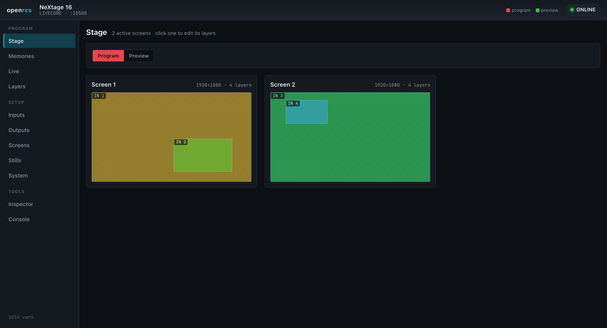
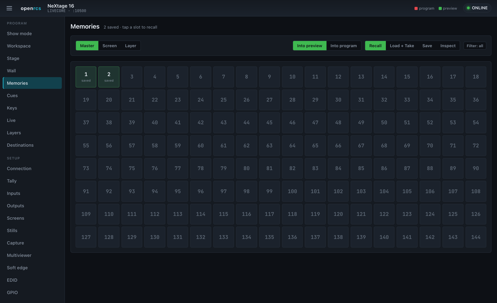
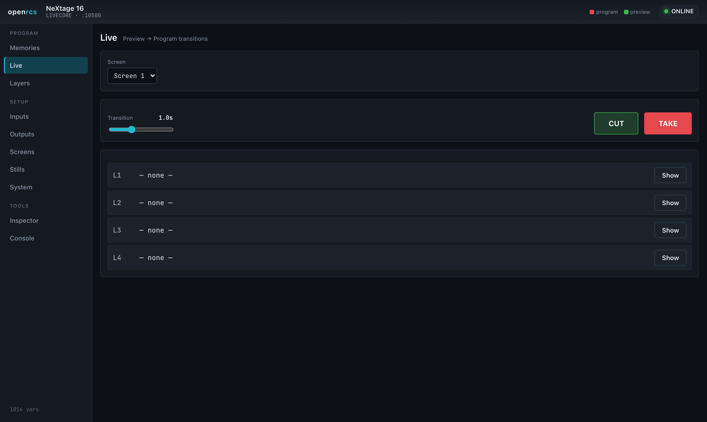
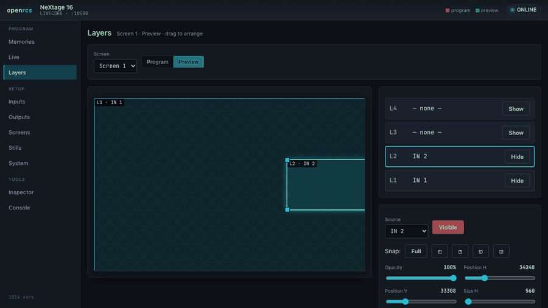
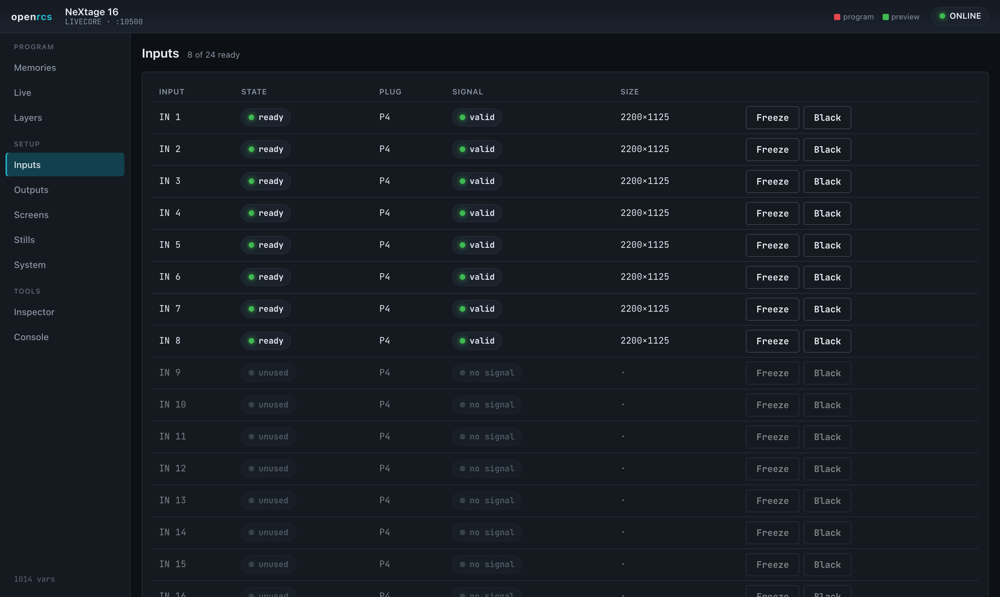
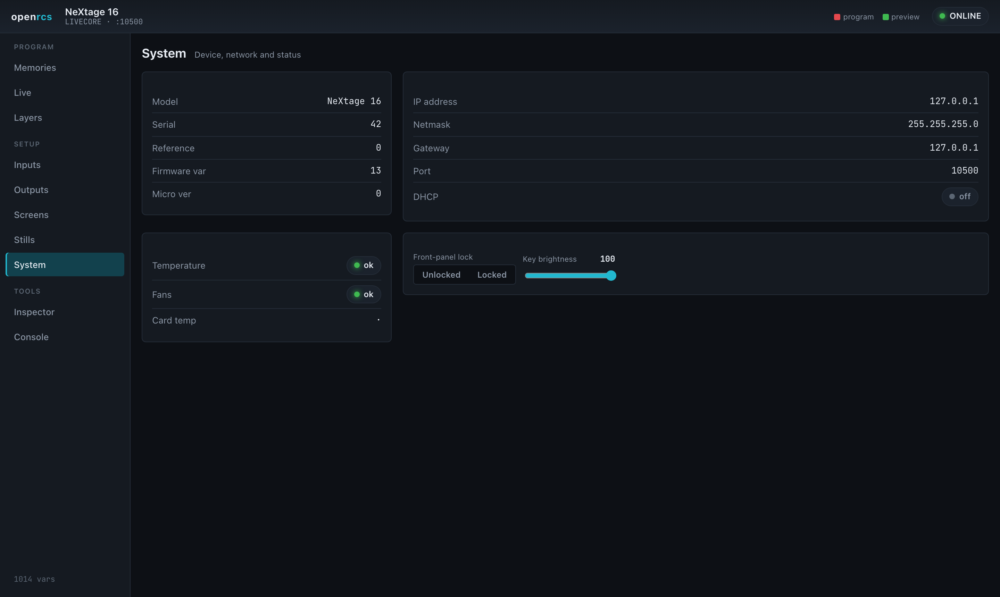

# openrcs — user guide

openrcs is a modern control surface for Analog Way **Midra** and **LiveCore**
series video processors. A small bridge server holds one connection to the
processor and serves a web UI to any number of browsers, so you can drive the
device from a laptop, a tablet, or a touch panel — no vendor runtime required.

## Running it

Start the bridge server, pointing it at the processor's control port (TCP
10500), and open the web UI:

```bash
cargo run -p openrcs-server -- --device <processor-ip>:10500 --platform livecore
# then open http://127.0.0.1:8730/
```

Use `--platform midra` for the Midra family. The header shows the device model,
platform and a connection indicator; every view updates live as the device — or
another operator — changes state.

The interface is a single dark theme, chosen deliberately for the blacked-out
environments these processors live in. The left nav is grouped into **Program**
(the things you touch during a show), **Setup** (configuration), and **Tools**.

## Stage



A mission-control overview: every active screen, drawn to scale with its live
layers, in one place. Layers are coloured by source so the same input reads the
same across screens. Toggle **Program / Preview**, and click any screen to jump
straight into its layer editor.

## Memories



Recall, store and take memories. Toggle between **Master** memories (whole-device
presets across all screens) and **Screen** memories (per-screen presets), and
choose what a slot tap does:

- **Recall** — load the memory into preview.
- **Load + Take** — load it and take it to program in one action.
- **Save** — store the current state into the slot you tap.

Saved slots light up, driven by the device's own validity flags, so the grid
always reflects what is actually stored on the hardware.

## Live



The take bar: choose a screen, set a transition time, and move preview to program
with **TAKE**, or switch instantly with **CUT**.

## Layers



Arrange sources on the screen visually. Each layer is a rectangle on a canvas
that represents the output: **drag to move, drag the corners to resize**, and use
the snap presets to fill the screen or drop a layer into a quadrant. The layer
stack on the right mirrors the canvas — assign a source, toggle visibility, and
fine-tune position, size and opacity with the sliders. A **Program / Preview**
toggle chooses which buffer you are editing.

## Setup — Inputs, Outputs, Screens, Stills



- **Inputs** — every input with its availability, active plug, live signal
  status and detected size, plus freeze and black.
- **Outputs** — the physical outputs, their connected displays, format and size.
- **Screens** — the output screens and their layer capacity.
- **Stills** — the still and logo library as a grid, with erase.

## System



Device identity, network settings, temperature and fan health, and front-panel
lock and brightness.

## Tools — Inspector and Console

- **Inspector** — search, read and set *any* of the device's variables. Useful
  for anything the dedicated views don't yet cover.
- **Console** — the raw protocol, sent and received, for diagnostics.

## Sharing a view

Each view has its own URL (`…/#layers`, `…/#memories`, and so on), so you can
bookmark or link straight to the panel you want.

## Notes

The LiveCore side is exercised against device behaviour; the Midra side is
complete in the protocol tables but has had less time on hardware. Per-variable
ranges are the device's declarations — the hardware is always the final
authority. The full protocol is documented in the
[openrcs-protocol](https://github.com/stoatworks-labs/openrcs-protocol)
reference.
