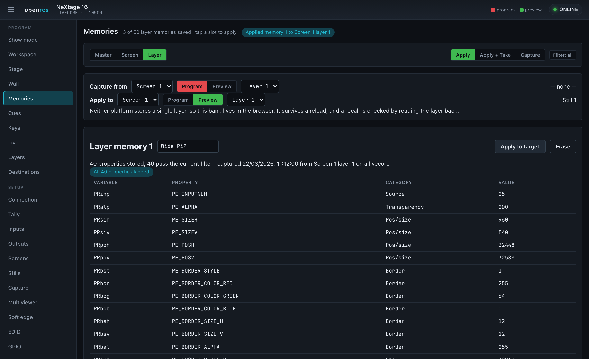
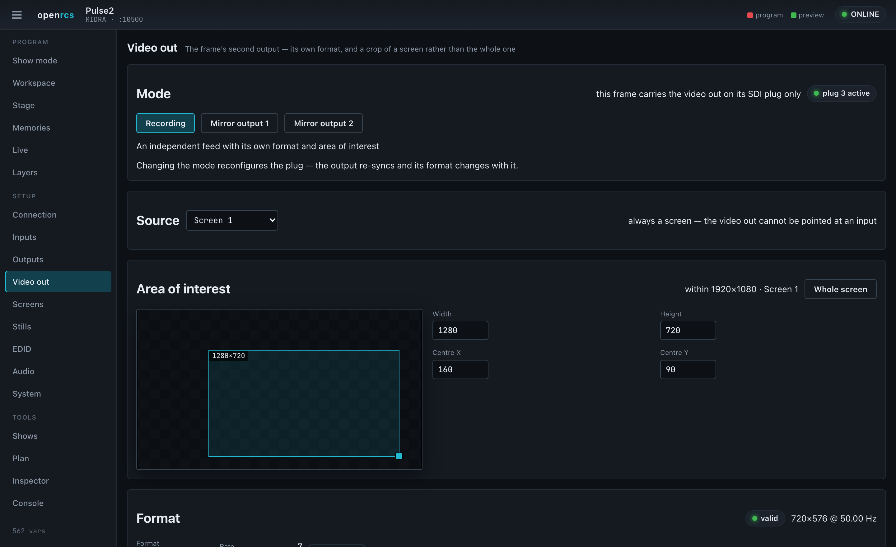
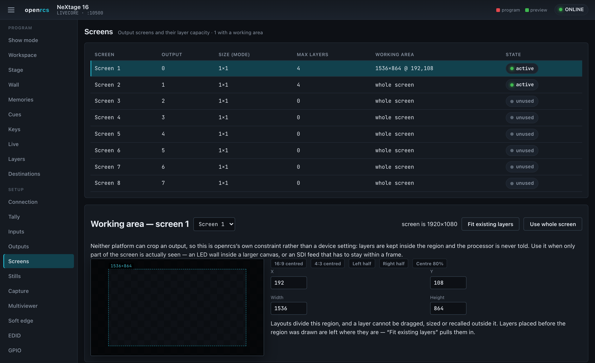

# openrcs — user guide

openrcs is a modern control surface for Analog Way **Midra** and **LiveCore**
series video processors, with an early mode for the current range —
**LivePremier**, **Midra 4K** and **Alta 4K** (see [that section](#livepremier-midra-4k-and-alta-4k)).
A small bridge server holds one connection to the processor and serves a web UI
to any number of browsers, so you can drive the device from a laptop, a tablet,
or a touch panel — no vendor runtime required.

## Running it

Start the bridge server, pointing it at the processor's control port (TCP
10500), and open the web UI:

```bash
cargo run -p openrcs-server -- --device <processor-ip>:10500 --platform livecore
# then open http://127.0.0.1:8730/
```

Use `--platform midra` for the Midra family, `--platform pls300` for a Pulse
PLS300, and `--platform livepremier`, `--platform midra4k` or `--platform alta4k`
for the current range, which listens on TCP 10606 instead (the port is filled
in from the platform when you leave it off). The header shows the device model, platform and a connection indicator;
every view updates live as the device — or another operator — changes state.

`--device` is optional. Started without one, the server comes up unconfigured
and shows only the **Connection** view: type the processor's address (or a
hostname), tap it in on the on-screen keypad, or press **Scan** to look for
processors on the network; then pick the platform and press **Connect** (or
Enter). The choice is written to a config file
(`~/.config/openrcs/config.json` by default, or `--config <file>`) and used on
the next start, so this only has to be done once. Connection also retargets a
running server — useful when one surface covers more than one processor.

The scan is read-only: it opens a connection, listens for anything the
processor volunteers, and never writes to what it finds — so it is safe to run
on a live network. Some processors identify themselves that way and some say
nothing at all; a result listed as **unidentified** was found and answered, it
just did not name its platform, so pick that yourself and connect. A processor
that already has a control session open elsewhere may not answer at all.

**No command line?** The [tray launcher](https://github.com/stoatworks-labs/openrcs/releases/tag/launcher-v0.1.0)
(macOS, Windows, Linux) bundles the server in a menu-bar app: enter the switcher's
IP, pick the model, click **Start**, then **Open**. Nothing else to install.

The interface is a single dark theme, chosen deliberately for the blacked-out
environments these processors live in. The left nav is grouped into **Program**
(the things you touch during a show), **Setup** (configuration), and **Tools**.

**It adapts to the device.** openrcs reads the variable table the processor
advertises and shows only the views that hardware actually supports — so a
LiveCore unit exposes the full set below, while a Midra unit shows the subset it
implements (and swaps in its own equivalents, e.g. a per-screen **Freeze** where
LiveCore offers a master fade). The two families model some things differently
— memories especially — and the UI follows each one's model rather than forcing a
single shape.


## New in this release

- **Layer memories** — a fourth memory bank beside master and screen. Capture one
  layer's whole property set and apply it to any screen, preset and layer, under the
  same category filter as a screen memory. No processor stores a single layer, so
  this bank lives in the browser: it survives a reload, travels in a show file, and
  every recall is checked by reading the layer back — which is how it catches a Midra
  refusing a source that has no signal.
- **Memories** gains what only the Workspace panel had: each slot's label as stored on
  the device, erase, an explicit preview-or-program target, and the device's own
  twelve-category record filter applied to every recall.
- **Video out** (Midra) — the frame's second output, on its own view. Choose what its
  plug is for, pick which screen it looks at, and drag an **area of interest** to send
  a crop of that screen rather than the whole thing. See the note below about what it
  can and cannot carry.
- **Area of interest** on each LiveCore output — staged, then committed with Apply.
  Unconfirmed on hardware; the panel shows the device's own readback rather than the
  numbers you typed, and says so.
- **Working area** — a region of a screen that openrcs composes inside. Layouts divide
  it, and no drag, resize, typed value or memory recall can put a layer outside it.
  Nothing is written to the processor to set one up. Use it when only part of a screen
  is really seen — an LED wall inside a larger canvas, or a feed that has to stay
  inside a frame.
- **Show mode** — a stripped, big-target front-of-house surface: large CUT ALL /
  TAKE ALL, a TAKE tile per destination, and a grid of master-memory recall tiles.
  The one to drive a show from a touchscreen at front-of-house.
- **Wall** — which output shows which tile of which screen. Each screen is a
  grid of output tiles (its size in tiles is set here), and the outputs that
  carry it sit on the tile they show, marked program or preview. Click an
  output, then a tile, to move it; **Apply to device** commits the layout with
  the frame's global output update, which re-syncs the outputs.
- **Destinations** — take, cut, T-bar and step-back whole **screen groups** as one
  destination, with a grouping editor and a TAKE ALL GROUPS.
- **Shows** — capture the device's writable state (the live look, the memory
  banks, input or output setup) to a portable JSON file and restore it. Restore
  re-reads the device first and writes only what differs. Also hosts
  **Confidence**, an instant cache-based undo that can auto-snapshot before every
  take.
- **Plan** — build a look with no device attached (reads preview your staged
  values), then push it to the processor on connect. Staged work persists across
  a reload; "Seed from look" starts from the current on-screen state.
- **Cues** now chain: mark a cue **autofollow** and it runs the next one after a
  per-cue wait, with a **HOLD** to pause and per-cue notes.

On LiveCore, a **take** now animates the T-bar directly rather than firing the
device's own take verbs — on real hardware those leave the group stuck
mid-transition, so openrcs sweeps the bar over the transition time instead.

## Workspace


One page that mirrors how you actually drive a show, with everything in reach:
the **source palette** down the left, **every active screen** in the middle with
its program above its preview, and the **layer properties** panel on the right.
The page fits the window — the previews grow to fill the space — and the memory
strip along the bottom folds away when you want more room. Collapse the main menu
with the button top-left (it stays collapsed) for more space still.

- **Drag a source onto a layer.** Drag from the palette onto a layer rectangle,
  onto a layer slot, or onto bare canvas — dropping on the canvas puts the source
  on the first free layer, where you let go. Clicking a source **arms** it instead,
  for touch panels: arm, then tap a layer. Arm **— none —** to clear a layer.
  The palette has **Inputs**, **Stills** and **Other** tabs on LiveCore.
- **Live thumbnails.** Where the device offers them (LiveCore inputs), the palette
  and the layers on the canvas show the actual picture on that input, refreshed a
  few times a minute. openrcs turns the device's snapshot system on for you.
- **Drag and resize** layers directly on each canvas, with every screen live at
  once, and use the **layout presets** — Fill, 2-up, 3-up, Quad, PiP, Stack — to
  arrange a screen's assigned sources into a common look in one click.
- **The layer properties panel** opens when you select a layer, and exposes
  everything the device holds for it: source and z-order, position and size (with
  keep-aspect, screen size, content size, a nine-point placement pad and aspect
  ratio presets), transparency and the master fader, cropping and aspect override,
  border style, colour, size and opacity, opening and closing transitions with
  their directions, timing and speed, the flying curve, and the effects — force
  transition, smooth move, flip, black & white, negative, sepia, solarise, strobe.
  A Midra unit shows its own equivalents instead, including per-layer opening and
  closing durations and a layer freeze.
- **Program sits above preview** for each screen, tagged red and green, with the
  live one marked **ON AIR**. Each canvas edits its own context, so you can build
  the next look underneath what is on air. **Show** picks which of the two you
  want; **Screens** toggles hide the ones you are not touching.
- **Take and Cut per screen**, plus a **T-bar** to run the transition by hand, a
  **step back** to the look before the last take, and — on a Midra — screen freeze
  and reload-program. **Take all** and **Cut all** in the top bar cover every
  visible screen, with a take time you set once.

  On a LiveCore, which preset bank is program moves as you take; openrcs reads
  that from the device rather than assuming, so the ON AIR tag always follows the
  real output. If a transition stalls, a **···** button appears to complete it.

- **Unusable sources are flagged.** A layer pointed at an input the frame does not
  have can never open, and a take waiting on it never lands — openrcs marks those
  layers amber and offers to clear them, rather than letting you discover it
  mid-show. On a Midra the same marking covers inputs with no signal, which the
  device silently refuses to put on a layer at all; if a drop does not take, the
  page says so instead of pretending it worked.
- **Memories** along the bottom. On LiveCore that is the device's 144 **screen
  memories** and 144 **master memories**, with save mode, load, load-and-take,
  erase, editable labels, and the per-category **filter** so a recall can bring in
  only the layer geometry, or only the sources, and so on. On a Midra it is the
  eight presets that live in the unit.

## Stage


A mission-control overview: every active screen, drawn to scale with its live
layers, in one place. Layers are coloured by source so the same input reads the
same across screens. Toggle **Program / Preview**, and click any screen to jump
straight into its layer editor.

## Memories


Recall, store and take memories. Toggle between **Master** memories (whole-device
presets across all screens) and **Screen** memories (per-screen presets), and
choose what a slot tap does:

- **Recall** — load the memory into preview.
- **Load + Take** — load it and take it to program in one action.
- **Save** — store the current state into the slot you tap.

Saved slots light up, driven by the device's own validity flags, so the grid
always reflects what is actually stored on the hardware. **Inspect** mode shows a
scaled thumbnail of a stored memory's layout — source, size and position of every
layer — without recalling it. On **Midra**, memories follow that family's model
instead: eight preset slots, each captured from the live program, with the same
inspect-thumbnail, recall and erase.

### Layer memories

The third tab in Memories. Pick the layer to **capture from** — screen, program or
preview, and which layer — then switch to **Capture** and tap a slot. The slot stores
every property that layer has: 40 of them on a LiveCore, 27 on a Midra, read from the
variable table your processor actually advertised rather than a fixed list.

To use one, set **Apply to** — any screen, either bank, any layer — and tap the slot.
The category chips apply here exactly as they do to a screen memory, so you can drop a
layer's position and size onto another layer without disturbing its source.

Two things worth knowing:

- **A recall is verified, not assumed.** openrcs re-reads the layer afterwards and
  names anything that did not land. A Midra silently refuses a source with no signal —
  no error, no echo — and this is the only way to see it.
- **A capture records which platform it came from** and refuses to apply on the other
  one. The two families spell the same properties with different ranges, so the numbers
  would land but mean something else.



## Video out — Midra

Most Midra frames carry a second output beside the numbered ones. On a frame where it
is the SDI plug, this is the only SDI the unit has, and this view is where it lives.

**Mode** decides what the plug is for. It is not a display setting — it reassigns the
plug:

| Mode | What the plug does |
|---|---|
| **Recording** | An independent feed with its own format and an area of interest. The format list is the RCS's own — PAL and NTSC in 4/3 and 16/9, 480p/576p, 720p, 1080i/p/sF, 2K; a frame that has only been seen at PAL 4/3 (720×576) in this mode is the extent of what has been checked. |
| **Mirror output 1** | The plug becomes an extra plug of output 1, carrying that output's full raster. HD if the output is HD. |
| **Mirror output 2** | The same, for output 2. |

Only the modes your frame offers are enabled; it reports which ones it has.

In **Recording** mode you also get a **source** — which screen the feed is a view of,
including the two tiled combinations — and an **area of interest**: drag the rectangle,
or type a size and centre, to send a crop of that screen instead of all of it.

> **The video out cannot be pointed at an input.** Every source it offers is a screen.
> To put one input on that plug, put the input on a layer of a screen the video out is
> looking at.

> **There is no HD area of interest.** The crop exists only in Recording mode, and
> Recording mode is standard definition. If you need a framed HD feed, mirror an output
> and constrain the composition with a [working area](#working-area) instead.



## Working area

Neither platform can crop an output at HD. When only part of a screen is actually
seen, openrcs can constrain itself instead: set a **working area** on the screen in
**Setup → Screens** and everything composes inside it.

- Layout presets divide the region rather than the raster — a quad is four cells of
  the part you see.
- A layer cannot be dragged, resized, typed or recalled outside it.
- Nothing is written to the processor. It never knows.

Shape presets cover the usual cases (16:9 or 4:3 centred, half the screen, centre 80%),
or type the four numbers. Setting a region deliberately does not move anything that is
already placed — **Fit existing layers** does that when you want it, across every
preset bank so a take cannot bring an overhang back.



## Cues


Turn your memories into a show script. Each cue recalls a master or screen
memory and takes it; **GO NEXT** runs the list step by step. Preview or Go any
cue directly, reorder and rename, and the current cue is highlighted. Cues are
saved in the browser, so your running order survives a reload.

## Keys


Programmable one-tap buttons. A key runs a sequence of actions — recall a
memory (with take), take a screen or all screens, freeze an input, black an
output, master-fade — so a whole cue-to-air, a panic black, or a freeze is a
single press. Tap **Edit** to build them; they persist in the browser.

## Live


The take bar: choose a screen, set a transition time, and move preview to program
with **TAKE**, or switch instantly with **CUT**.

## Layers


Arrange sources on the screen visually. Each layer is a rectangle on a canvas
that represents the output: **drag to move, drag the corners to resize**, and use
the snap presets to fill the screen or drop a layer into a quadrant. The layer
stack on the right mirrors the canvas — assign a source and fine-tune position,
size, opacity, border, crop and per-layer transitions, and raise or lower a
layer in the stack. A **Program / Preview** toggle chooses which buffer you are
editing, and each screen has a native **Background** (colour or a background set).

On **Midra**, a **Layout** picker offers the processor's built-in arrangements —
choose one and the device lays the layers out for you, ready for sources.

## Setup


The Setup views cover configuration and monitoring. Which ones appear depends on
the device:

- **Tally** — a live on-air grid: each source lights red on program, green on
  preview, straight from the device's own tally bus.
- **Inputs** — every input with its availability, active plug, live signal status
  and detected size, plus freeze and black.
- **Outputs** — the physical outputs, their connected displays, format, size,
  HDCP and output processing (brightness, contrast, gamma, gain). The format and
  rate lists are the device's own, named as its RCS names them — *HDTV 1080p*,
  *Computer 1920×1080 (16:9 1080p)*, *Internal rate* — and the table shows each
  output's format the same way.
- **Screens** — the output screens and their layer capacity.
- **Stills** — the still/logo library as a grid (LiveCore), or the frame store
  (Midra), showing what's stored and its size.
- **Capture** — grab a frame from a live source into the still library: pick a
  source and capture the full frame or a graphical region.
- **Multiviewer** — a drag-and-resize layout designer for the monitoring outputs:
  place up to twelve widgets, pick each one's source, and store layout memories.
- **Soft edge** — a per-edge blend editor for multi-output screens: click an edge
  to feather it into its neighbour and set the black level.
- **EDID** — set an input's preferred format and read the EDID a connected display
  advertises. The **custom-EDID writer** builds a valid EDID for any resolution
  and refresh rate and writes it to an input, so a source outputs exactly what you
  want.
- **Audio** — output volume, balance, delay and mute, plus per-input channel
  levels where the device provides them.
- **GPIO** — trigger inputs and tally/relay outputs.

Inputs and outputs also carry image adjustment: click an input row for
brightness, contrast, colour, hue, RGB gain and crop; each output has its own
processing and a format/rate selector.


## System


Device identity, network settings, temperature and fan health, and front-panel
lock and brightness.

## Tools — Inspector and Console

- **Inspector** — search, read and set *any* of the device's variables. Useful
  for anything the dedicated views don't yet cover.
- **Console** — the raw protocol, sent and received, for diagnostics.

## Sharing a view

Each view has its own URL (`…/#layers`, `…/#memories`, and so on), so you can
bookmark or link straight to the panel you want.

## LivePremier, Midra 4K and Alta 4K

The current range — **LivePremier** (Aquilon C / RS), **Midra 4K** (QuickVu 4K,
Pulse 4K, Eikos 4K, QuickMatrix 4K) and **Alta 4K** (Zenith 100 / 200) — speaks a
different protocol from the two families above, the vendor's published AWJ, and
openrcs drives it through a surface of its own, plus the Connection view it
shares with everything else. None of the Midra/LiveCore views apply to these
processors, so the nav does not offer them. LivePremier gets **Screens** and
**Presets**; Midra 4K and Alta 4K get those two with more on them, and
**Layers** and **Inputs** besides.

- **Screens** — every screen (and, on a Midra 4K or Alta 4K, every auxiliary)
  the processor has in service, with the transition state it is holding, which
  preset buffer is on program and which is preview, its take time — one on Midra
  4K / Alta 4K, an up/down pair on LivePremier — and **Take** and **Cut** per
  destination. On Midra 4K and Alta 4K the row also has a **Memory** column
  (which bank slot each buffer was loaded from, program / preview), a take time
  you can type, a **T-bar**, **Freeze** for the destination, **PGM → PRW** (copy
  program to preview), **Step back** and a **swap** flag, and the panel has
  **Take all** and the **Quick preset** — the device's emergency key: one
  switch puts fade to black, a library image or a master memory (pick which)
  on every covered program output, and takes it off again; the destination
  buttons beside it say which are covered and which are showing it now. Two of
  those are not what the same words mean on a LiveCore:
  **Step back** here is the device's own — it reverts the last change to layer
  settings, an edit undo, and does not return to the previous look; and **swap**
  is the preset toggle: on, a take swaps the two buffers; off, it copies preview
  to program and leaves preview as it was. Take all fires one take per
  destination in service, which is exactly what the vendor's Web RCS does.
- **Layers** (Midra 4K / Alta 4K) — one screen at a time, program or preview,
  its fitted live layers drawn on a canvas at the applied configuration's size,
  each showing the unit's own picture of its input. **Drag** a layer to move it
  and its **corners** to resize; **Fill / 2-up / 3-up / Quad / PiP** lay the
  fitted layers out in one tap. The panel on the right edits the selected
  layer: its **source** (an input by number and label, or colour), centre and
  size in pixels, **Freeze** and a **Fader** with **Fade in / Fade out** — both
  live on the screen rather than the buffer, so they hold through a take — and,
  folded away below, opacity, crop, mask, effects, border, shadow and
  transitions with the ranges the device declares. **BG** and **Top** beside the
  layer buttons are the preset's two fixed layers: the background (one of the
  eight sets Preconfig built, or a plain colour, with its opacity) drawn as the
  canvas ground, and the top frame (one of the screen's four top-frame slots)
  drawn over everything at the slot's own size, draggable like a layer. An
  auxiliary has no layers on this platform; picking one shows its single
  background source instead. Every write is read back; with **Live updates**
  on, the device pushes the whole destination as it changes.
- **Presets** — the processor's preset banks: one 1000-slot screen bank on
  LivePremier; on Midra 4K and Alta 4K the **Screen** (200), **Aux** (200) and
  **Master** (50) banks as chips. Pick preview or program, pick the destination
  (or every one in service), and tap a slot to recall it; a slot the device
  reports as empty cannot be recalled. With a single destination selected, the
  slot on its program is outlined red and the one on its preview green. On Midra
  4K and Alta 4K the bank also writes: **Save** stores the chosen destination's
  program or preview into a slot, **Label** names one, and **Erase** clears one
  on a second tap. A master save from program or preview also stores every
  destination in service into its own bank — the device does that, at a slot
  number of its choosing, and out of the box that number is 1 for every
  destination, which is how a master save silently overwrites screen memory 1.
  openrcs points those at the master's own slot number instead and refuses the
  save if any of them is already in use; or save **from the memories each
  buffer already holds**, which writes no bank slot at all. Banks are read fifty
  slots at a time — each slot costs two reads — and **Read slots…** fetches the
  next page.
- **Show** (Midra 4K / Alta 4K) — every screen and auxiliary in service side
  by side: each screen's program or preview (one switch for all) on its own
  canvas, editable exactly as on Layers — drag, resize, snap, the layout
  presets — with a quick source and opacity for the layer you touch and
  **Open in Layers** for the rest; each auxiliary's source with its picture;
  **Take** and **Cut** per destination, **Take all** and **Cut all**. **Show
  mode** puts everything in one big column with large take buttons, for a
  front-of-house table or a touch screen.
- **Cues** (every AWJ family) — a cue list over the memory banks. A cue is a
  master memory, or a screen's or auxiliary's memory on one destination;
  **Go** loads it to preview and takes it a quarter of a second later, **Cut**
  loads it straight to program, **Arm** loads it to preview and leaves it
  there. Per-cue **autofollow** with a wait chains cues; **Hold** stops the
  chain. The list is kept in this browser for this processor — neither Web
  RCS has a sequencer, so there is nothing on the device to keep it in.
- **Plan** (every AWJ family) — with plan mode on, every value you set on
  the other pages is staged here instead of written, reads show the staged
  values so the look previews as you build it, and **Push** writes the lot
  when a processor is there. Takes, recalls and every other trigger still go
  straight to the processor: they are actions, not state.
- **Inputs** (Midra 4K / Alta 4K) — every input the unit has, with its
  picture, its active plug, connector and the signal on it, **Freeze** and
  **Black**, and where the device says it is on air (program / preview) — from
  the processor's own tally lists, so nothing is inferred. Tap an input to set
  its plug up: which plug is active, its label, signal type and HDCP from the
  lists the device allows, HDR mode and nits, the picture (brightness through
  RGB offsets, sharpness, pulldown), aspect (what the signal is, what to show
  it as, how a layer fills it), a predefined or typed **crop** applied with the
  device's own trigger, the **keyer** — off, chroma, luma or cut and fill, with
  the parameters of whichever is chosen and the sampling assistant; the device
  says which inputs have a keyer and which can be a fill, and offers only
  those — the **LUTs**: a conversion LUT (colour space and HDR on the way in)
  and a correction LUT after it, each auto or a slot from the library the
  device offers this plug — and the **EDID** the plug presents, decoded (make,
  name, preferred timing) and replaceable from the device's library of factory
  and saved EDIDs.
- **Audio** (Midra 4K / Alta 4K) — the clock and rate, then every routing
  point the device has: for each screen and auxiliary the **audio layer** its
  program and preview buffers carry (one source per buffer, saved with the
  memory and swapped by the take), whether its output follows that layer, a
  live layer's content or a source routed straight; each video output (the
  screen it shows, direct, or none), the multiviewer (a widget or direct, and
  which widget shows VU meters), the two line outs and the four Dante groups
  (a screen or direct, and the channel pair), mutes on all of them, the ten
  **custom sources** built channel by channel from any embedded, Dante or
  analogue channel the unit lists, and **level readings** of one input and one
  output at a time, on request. What the quick preset does to audio is here
  too. The Dante panel shows the card's state and its channels' subscriptions;
  the subscriptions themselves are made in Dante Controller.
- **Setup** (Midra 4K / Alta 4K) — the device's **configuration**: a template
  to load, the four layer resources (off, one seamless layer or two split ones,
  and which screen), every output's role (screen, auxiliary, multiviewer, off)
  and the screen or auxiliary it feeds, which screens and auxiliaries are in
  service and each screen's background layer type — every choice from the
  device's own validity lists — then **Compute**, a side-by-side of the
  computed and the applied state, and **Apply** behind a second tap, since
  applying rebuilds the whole pipeline and blanks every output for a few
  seconds. The second tab is each screen's **canvas**: one output, a grid of
  outputs (columns, rows, empty-cell size, gaps, which cell each output sits
  in) or free placement (canvas size and each output's top-left corner), each
  applied with the device's trigger, plus the screen's **test pattern** and,
  on a grid, the **soft edge** of each gap — blend on or off, a gamma or Bézier
  curve, the black level — applied with the grid's own soft-edge trigger (only
  an Eikos 4K blends; the others hold the settings). The third tab is **LUTs**:
  the conversion and correction libraries — each slot's label, file and colour
  spaces, erase — and the four LUT resources, each allocated to an input; a
  `.cube` file reaches a slot through the Web RCS's upload.
- **Presets** (Midra 4K / Alta 4K) — in Save mode a panel shows **what a save
  records**: for a screen the categories (source, position, size, opacity,
  crop, mask, border, transitions, effects, flying curve, timing, speed,
  audio), which live layers, and whether the background and top layers go in;
  for an auxiliary its four categories; for the master bank which screens and
  auxiliaries and what of each. The filter is the device's own and stays set;
  a memory recalls only what it recorded. In Recall mode, **Autoscale on
  load** per screen — the device's own flag — rescales a memory's layers to
  that screen's canvas on load, or keeps them as saved; the Multiviewer page
  has the same switch for its layout memories.
- **Screens** (Midra 4K / Alta 4K) — tick destinations to **take, cut or
  T-bar them as one group** (All / Screens / Auxes / None pick them quickly);
  each keeps its own take time.
- **Layers** (Midra 4K / Alta 4K) — drags **snap** to the canvas edges and
  centre lines and to the other layers' edges and centres (hold Alt to drag
  free); the arrow keys **nudge** the selected layer a pixel, ten with Shift,
  once the canvas has focus; **Copy layer** takes every property the panel
  holds, source included, and **Paste** puts it onto any layer of any screen or
  buffer. Twelve layout presets: Fill, 2-up, 3-up, Quad, PiP, PiP ×2, 1 + 2,
  1 + 3, 3×2, 4×2, Columns and Rows, over the fitted layers in slot order.
- **Multiviewer** (Midra 4K / Alta 4K) — the monitoring output's windows on a
  canvas at that output's size: drag to move, corners to resize, **Quad / 3×3
  / 4×3 / 4×4** grids over the windows this unit can use. The panel sets a
  window's source (an input, a screen's program or preview, a timer), its
  on-screen label and whether it is shown. Twenty **layout memories** with the
  same recall / save / erase / label modes as the preset banks, and the three
  **timers** — clock, countdown or stopwatch, with start, pause and stop.
- **Outputs** (Midra 4K / Alta 4K) — every output with its picture, what the
  applied configuration uses it for, its format and rate, the plug's state,
  and — tap one — its label, a format from the list the device allows for
  that role (applied through the device's own update trigger), a **test
  pattern** switched on and off, and the picture settings: gamma, brightness,
  contrast, saturation, hue and RGB gains. Below those: the **area of
  interest** (the part of the format the screen's canvas fills, in thousandths,
  with overscan) and the **pitch** for LED walls, each applied with its own
  trigger; HDR mode and nits with what the output is sending; colorimetry; the
  plug's pixel encoding, HDCP policy (from the list the plug allows), embedded
  audio and SDI level, with whether HDCP is up on the link; the output's
  conversion and correction **LUTs**; the **connected
  display's EDID**, decoded, with a button to save it into the device's EDID
  library under a name and slot so an input can present it; and **custom
  formats** — sixteen slots to name and erase, and an editor that takes a
  size and rate (CVT) or every porch and sync (full), **Check**s it on the
  device, shows the totals and pixel clock it worked out, and saves it into a
  slot, after which every output's format list offers it.
- **Stills** (Midra 4K / Alta 4K) — the fifty-slot still library with each
  image's name and size, erase behind a second tap, a **capture** of any input,
  output or the multiviewer into the next free slot or one you pick, and every
  screen's four back and four top frame slots with the library slot each
  points at and its picture.
- **System** (Midra 4K / Alta 4K) — model, series, firmware and serial, the
  network address, the temperature sensors and case fans with their alarms,
  the front-panel lock and brightness, and a reboot behind a second tap. Below:
  the two **configuration slots** on the device — back the whole configuration
  up into one under a label (every module the device lists, stills included),
  label, **restore** (behind a second tap; the device unpacks the slot, applies
  every module it holds and reboots) or erase it; export to a file and import
  from USB stay with the Web RCS — and **streaming**: ten RTMP destinations
  (label, URL, key, whether keys are kept), which one to stream to, the picture
  source, profile and quality, the audio (following the picture or a source,
  which pair, mute) and start / stop with the device's status.
- **Inspector** (every AWJ family) — every property this bridge has read so
  far, searchable; a box to read any path and write any value as JSON; and
  the wire log. What the dedicated views do not cover yet is reachable here.

What the simulators accept but do not act on is written but unproven: a timer
never leaves *idle*, a capture never completes, the tally lists never fill, a
stream never starts, a custom format is never erased (the slot stays), a grid
change never moves the canvas size, and no simulator input reports a chroma /
luma keyer (cut and fill is offered on the odd inputs and was set).

The pictures come from the processor's own HTTP server — port 80 on a unit.
A simulator serves them wherever it was started, so **Connection** has a
*Thumbnails from* field for that case alone; leave it empty for a real unit.
- **Live updates** asks the processor to push changes; it tells a client nothing
  until asked. One switch for all these views: until it is on, what you see is
  what was last read, and every write reads its target back rather than assuming
  it landed.

A wrong pick is caught rather than shown as an empty show: LivePremier and the
4K boxes share a port but not an object model, so if the surface was pointed at
one while set to the other, a banner names the processor it actually found and
says which platform to pick in Connection.

On Midra 4K and Alta 4K, recalling a preset also overwrites the destination's
take time with the one stored in the memory — that is the processor's own
behaviour, and the Screens view shows the new time straight after the recall.

## PLS300

The **Pulse PLS300** is the generation before Midra: the same port and framing,
one screen, two outputs (main and preview), ten inputs numbered 1–6 and 9–12,
and one preset grid — a *current* preset on air, a *next* preset you edit, the
*previous* look, and four user presets. Nothing of the Midra/LiveCore surface
fits that model, so the PLS300 has eight views of its own, plus the shared
tools (Shows, Plan, Inspector, Console) and Connection. Everything here comes
from the vendor's published Programmer's Guide and has been exercised only
against a simulated unit built from it; **no PLS300 has been connected yet**.
Before one is: the unit ships with LAN off — enable it on the front panel
(Control menu) — and answers on TCP 10500.

- **Live** — the next preset's five layer slots (background frame, background
  live, PiP, two logos) with the source now on air beside a picker for what
  goes on next; **TAKE**, the **T-bar**, auto-take and preset-toggle switches;
  the unit's six quick layouts; which layer the preview output shows; the four
  user presets as one-tap recalls into next; per-input **freeze** (or freeze
  all); and **output black** for main and preview.
- **Layers** — a canvas of the main output, to scale, for any of the seven
  presets: drag a layer to move it, its corners to resize, or type the numbers.
  Opacity, crop, border, and the opening and closing effects with their
  direction and duration. Editing *Current* changes the picture on air.
- **Memories** — the four user presets and the previous look. **Recall** puts
  one into next, **Recall + take** puts it on air, **Save** stores current or
  next into a slot; right-click a slot to inspect what it holds. All of it is
  the unit's own preset-copy verb, which the panel at the bottom also exposes
  directly.
- **Inputs** — each input's type, signal, size and rate, freeze and autoset;
  click a row for its picture, geometry, aspect, crop and keying settings, and
  HDCP on the DVI inputs. The EDID of the four plugs that carry one, and the
  backup input the unit falls to when a source drops.
- **Outputs** — main and preview: format, rate, analog and digital signal
  types, sync polarity, test pattern, background colour, anti-flicker, gamma,
  sharpness, HDCP, and the frame-lock reference and mode with what the unit
  reports it is locked to.
- **Audio** — master volume, mute, stereo and delay per output, the auxiliary
  input, and per-input level, balance and audio-source map, with SDI
  de-embedding channel picks on the SDI inputs.
- **Pictures** — the six frames and six logos the unit stores, with their
  sizes; capture one from an output (position, size, keying, animated-logo
  frame count) or delete one.
- **System** — device identity and versions, the fitted options, network
  (read-only — turning LAN off would end the session), front-panel lock and
  brightness, standby, the display device on the RS-232 port, and the resets
  behind an arm switch.

## Notes

Both families have been driven against real hardware — a NeXtage 16 (LiveCore)
and a Pulse2 (Midra). The PLS300 has not: its table and its views are from
the Programmer's Guide alone. A few behaviours still depend on the device: assigning a
live input needs a signal present on it, and some capabilities vary by model and
firmware (openrcs hides what a given unit doesn't implement). Per-variable ranges
are the device's declarations — the hardware is always the final authority. The
full protocol is documented in the
[openrcs-protocol](https://github.com/stoatworks-labs/openrcs-protocol)
reference.

The AWJ side is newer. Its LivePremier paths come from the vendor's published
guide and have been read from two Aquilon C frames; its Midra 4K / Alta 4K paths
were read off a Pulse 4K. The operations underneath — take, cut, recall, the
subscription behind Live updates — are confirmed on both kinds of hardware, but
by a separate test harness: openrcs's own surface for these processors has been
driven end to end only against the vendor's simulators. Treat the wire as
settled and the surface as in field testing.
